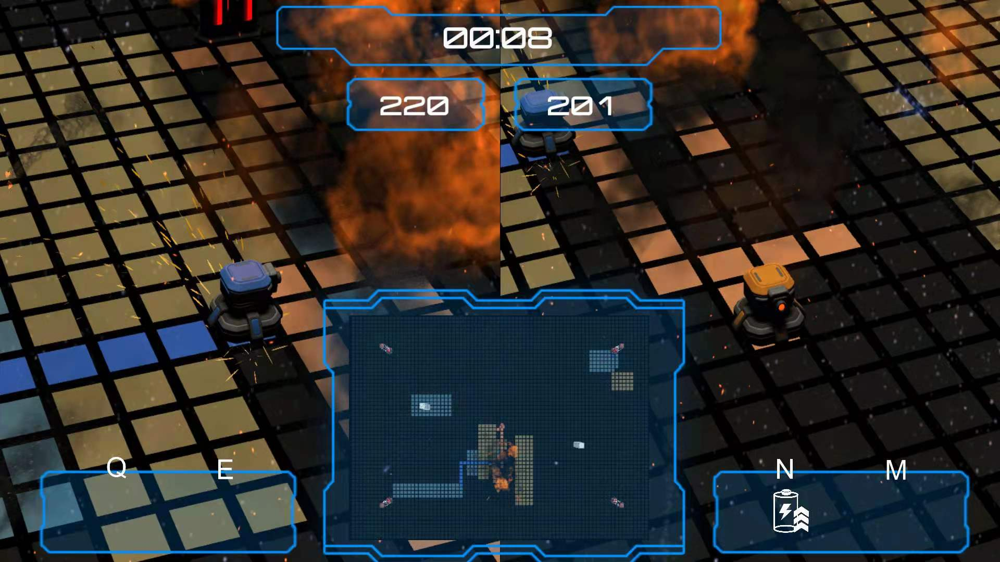
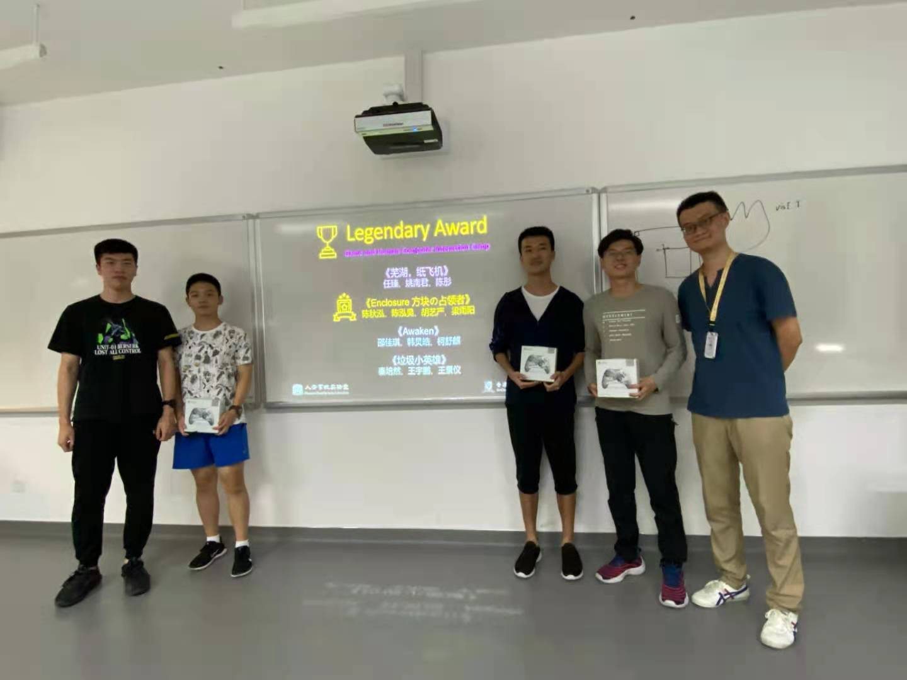

# Enclosure - 方块の占领者

**Enclosure (方块の占领者)** 是一个由四名[香港中文大学（深圳）](https://www.cuhk.edu.cn/)大二学生历时两周开发的多人迷你游戏。这也是四人作为Unity新人开发者的第一个游戏作品。

游戏中，双玩方家需操纵各自的机甲，尽可能地通过移动轨迹“圈占”自己的领地，扩大己方势力。同时，玩家可以选择占领对手的领地或打断对手的“圈地轨迹”，以此削弱对手、壮大自身。最终，占有领地面积更大的玩家将获得胜利。

玩家需要把握时机、随机应变，做出正确的决定：是优先圈地扩充自己的势力，还是主动出击打断对手的路线，亦或者拾取战场中的道具、通过传送门瞬移来达到一些意想不到的效果……每一次的决定都关乎最终的结局，而瞬间的犹豫都可能让你与胜利失之交臂。

游戏支持本地双玩家对战及通过局域网联机。快来下载尝试一下吧！

* 项目主页：https://enclosure-developer.github.io/
* 下载链接：https://github.com/enclosure-developer/enclosure/releases/

